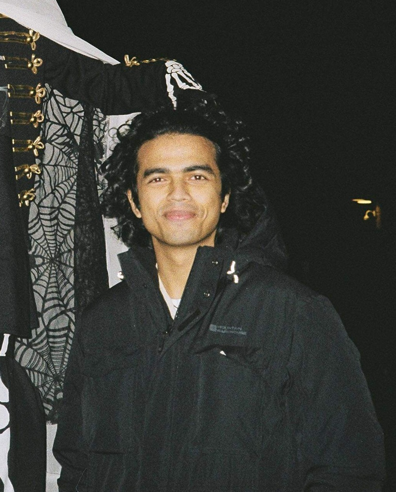

<!-- {: style="float: right, width:50x"} -->

    
    

        
<a href="{{ sites.baseurl }}/resources/general/Rudraksh-Kapil-CV.pdf">CV</a>

        
<a href="https://linkedin.com/in/rudrakshkapil">LinkedIn</a>

        
<a href="https://github.com/rudrakshkapil">GitHub</a>

    

Hello! My name is Rudraksh. I am a recent M.Sc. Thesis-based Computer Science graduate from the University of Alberta. I'm highly skilled in machine learning and deep learning, especially in the computer vision domain, with proficiences in Python & its various libraries (PyTorch, scikit-learn, etc.), C++, Java, and C#. I'm currently looking for Machine Learning Engineer roles where I can bring a data-driven approach to solve practical problems in industry. You can find my full CV [here](resources/general/Rudraksh-Kapil-CV.pdf). Feel free to reach out to me over [email](mailto:rkapil@ualberta.ca) or [LinkedIn](https://linkedin.com/in/rudrakshkapil) if you are interested in connecting with me.

I most recently worked as an ML Remote Sensing Analyst during my FSWEP placement with the Canadian Federal Government at Natural Resources Canada, where I leveraged cutting-edge computer vision techniques to solve Forest Health Monitoring problems. During my master's degree, I successfully published two first-author papers, and have another one coming up at a top computer vision conference. I have also worked as a ML/DL Researcher and Teaching Assistant over several semesters, and served as a Lead Student Instructor for a Python Programming undergrad course during one of those.

In 2021, I graduated First Division with Distinction from NIT Warangal with a B.Tech. in Computer Science and Engineering. During my undergrad degree, my highlights include co-authoring two conference papers and being the Lead Programmer for GBit Studios, a startup in the game development industry where I created and released several games built using Unity and Android Studio (Java).

